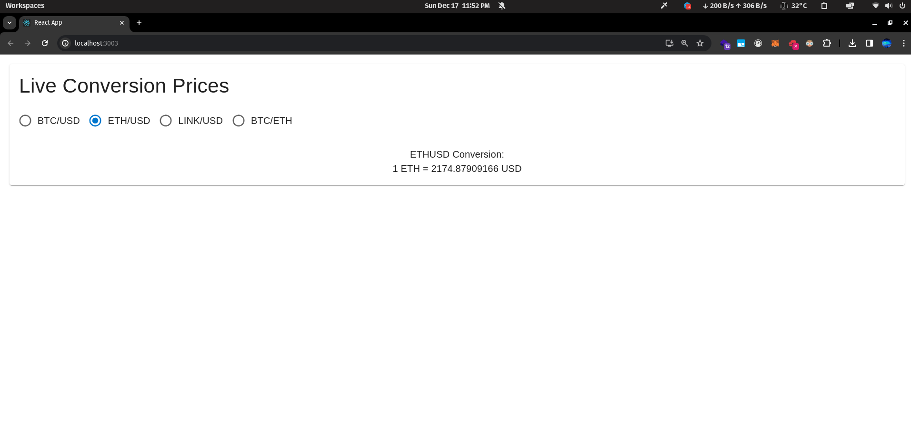

Student Name: Sarthak Kaushik
------------------------------

Admission Number: 101471600
----------------------------

How to Run:
-----------

- The contract is already deployed, you can re-deploy if you wish.

- Run: `npm install`

- If the above command fails, run `npm install --force`

- The browser window will open up. 

- Just connect the Metamask wallet if you redeployed and change its private key inside the `.env` file.

- Then you would be able to see the conversion prices: 

